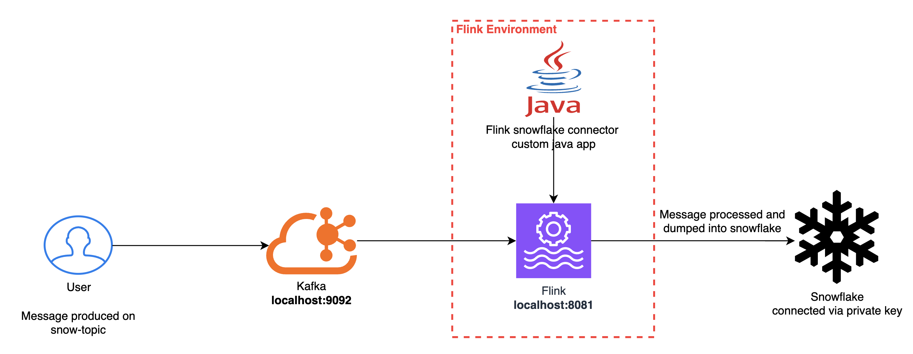
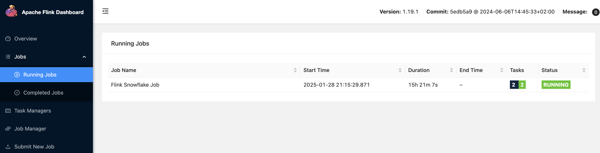

# flink-snowflake-connector-sink-app
Pipe streaming data into snowflake table using flink snowflake connector



## Local kafka setup

```sh
cd local-kafka-testing
docker compose up
```
### Publishing a message to the Kafka topic
Let the topic be `snow-topic` and the message be in `myMessage.txt`
```sh
kcat -b 127.0.0.1:9092 -t snow-topic -P myMessage.txt
````

### Consuming the message from the Kafka topic
```sh
kcat -b 127.0.0.1:9092 -t snow-topic -C -f 'Topic %t, partition %p, offset %o, key %k: %s\n'

kcat -b 127.0.0.1:9092 -t snow-topic -p 0 -o 5 -C -f 'Topic %t, partition %p, offset %o, key %k: %s\n'
```

## Local Flink cluster setup

```sh
mkdir ~/flink-test && cd ~/flink-test
wget https://dlcdn.apache.org/flink/flink-1.19.1/flink-1.19.1-bin-scala_2.12.tgz
tar zxf flink-1.19.1-bin-scala_2.12.tgz 
cd flink-1.19.1/bin
``` 

```sh
# You can visit http://localhost:8081/ now to see your status, running jobs, etc
./start-cluster.sh
``` 


### Java and maven version
Java app is built using maven. The dependencies are added in the `pom.xml` file.
Java and maven version are specified in the `pom.xml` file.
```angular2html
Apache Maven 3.9.9
Maven home: /opt/homebrew/Cellar/maven/3.9.9/libexec
Java version: 23.0.1, vendor: Homebrew, runtime: /opt/homebrew/Cellar/openjdk/23.0.1/libexec/openjdk.jdk/Contents/Home
Default locale: en_IN, platform encoding: UTF-8
OS name: "mac os x", version: "15.3.1", arch: "aarch64", family: "mac"
```

## Building the Java app
The output jar is built in the `target` directory
```sh
cd snowflake_mapping
mvn package
```

### Mapping the snowflake table columns, Kafka JSON message and the Java app serialization mapper class
Snowflake credentials are put in the main function of the java app, in the file `FlinkSnowflakeJob.java`.
It becomes important to map the JSON data produced by kafka into the Java class so that it dumps into snowflake seamlessly.

* Make sure the snowflake destination table created has column names that match exactly as the JSON keys of the Kafka data stream
* If the message to produced to the kafka topic is in myMessage.txt. The contents of the text file are as given below then the Snowflake table definition should be as subsequently shown.
  Note: The JSON keys and snowflake table columns should not have any special character apart from underscore.
* The Java class should have the mapping of the JSON keys to the Java class fields. The Java class should have the same fields as the snowflake table columns.
* The Java class should have the same fields as the snowflake table columns.
* The mapping of JSON data with java class is done `ExampleRecord.java` file. The name of the variables defined should be same as JSON keys.
  The `ExampleEnrichedRecordToMapConverter.java` also must have mapping keys same as the JSON data and snowflake table column names
* Even if the JSON data is sent through Kafka with extra key-value pair. Data will land to snowflake table with only the columns defined in the table. Extra key-value pair will be ignored.
* It is important that the mapping exist in Java class as part of the Flink job.
* However, if the mapping does not exist in Java class as part of the Flink job. And you send data with extra key-value pair. The job will fail with error message.

## Running the JAR in the local Flink cluster
```sh
# Submit a jar to the cluster
./flink run /Users/you/path/to/target/jarfile.jar
```

### Viewing the job in the Flink dashboard
Visit `http://localhost:8081/` to see the status of the running jobs.


## Send the Kafka message and verifying it in Snowflake table
### Publishing a message to the Kafka topic
Let the topic be `snow-topic` and the message be in `myMessage.txt`
```sh
kcat -b 127.0.0.1:9092 -t snow-topic -P myMessage.txt
````
